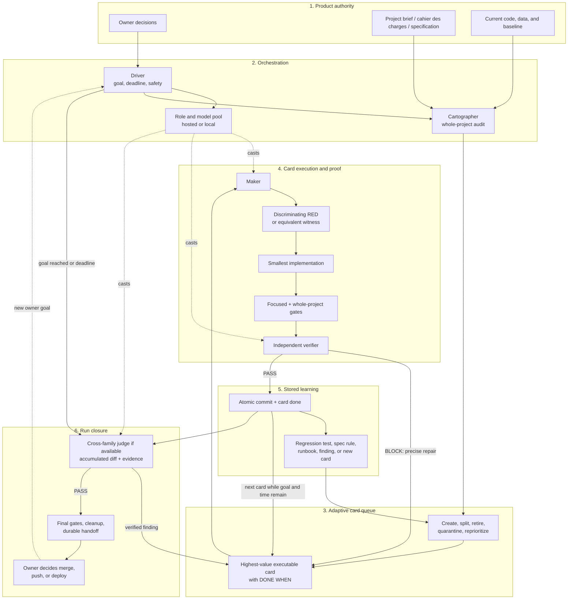

# Loop Engineering

Loop Engineering is an agent-agnostic method for pursuing a concrete goal on
a project autonomously, one verifiable card at a time, until the goal's
condition actually holds.

It is a skill, not a shell driver. It contains no orchestration scripts and
does not require a particular vendor. Codex, Claude Code, Gemini, Hermes, a
local LLM runtime, or a mixed pool can apply it using their native agent and
tooling capabilities.

The central rule is simple:

> A claim is true only after its evidence has been executed and inspected.

The loop is self-improving in an observable sense: every verified defect
becomes a better test, card, specification rule, or operating lesson; the queue
is continuously audited and rearranged; and each cycle should leave fewer
unknowns and fewer repeated failure modes than the previous one.

## How the loop works

The system has six layers. Product authority defines truth. The driver owns the
run. The cartographer reconciles that truth with the current project and
maintains an adaptive card queue. Makers execute one card at a time. Tests and
independent verification control acceptance. The closure judge reviews the
whole accumulated result, not isolated cards.



The return arrows are the mechanism:

- a verifier blocker becomes a precise repair card;
- an accepted card stores its tests and lessons, then the queue is audited
  again before selection continues;
- a closure-judge finding becomes a top-priority card and is fixed forward;
- a new owner goal starts another run from current product authority, not from
  a stale historical plan.

This creates two nested feedback loops:

1. **Card loop:** select → establish RED → implement → run gates → verify →
   commit or repair.
2. **Run loop:** audit the whole → execute cards → learn and rearrange → judge
   the accumulated diff → clean up and hand control back to the owner.

No layer declares itself successful. Every layer is checked by executed
evidence or by a different downstream role.

Rendered versions: [SVG](diagrams/loop-engineering-architecture.svg) ·
[PNG](diagrams/loop-engineering-architecture.png) ·
[editable Excalidraw](diagrams/loop-engineering-architecture.excalidraw) ·
[Mermaid source](diagrams/loop-engineering-architecture.mmd)

## Install

Clone the public repository directly into your agent's skills directory.

### Claude Code

```sh
mkdir -p ~/.claude/skills
git clone https://github.com/scavalpha/loop-engineering.git \
  ~/.claude/skills/loop-engineering
```

### Codex

```sh
mkdir -p ~/.codex/skills
git clone https://github.com/scavalpha/loop-engineering.git \
  ~/.codex/skills/loop-engineering
```

Recent Codex versions load the Agent Skills format from
`~/.codex/skills/loop-engineering`. On older versions, point the project's
`AGENTS.md` at the cloned `SKILL.md`.

### One clone shared by Claude Code and Codex

```sh
mkdir -p ~/.local/share/agent-skills ~/.claude/skills ~/.codex/skills
git clone https://github.com/scavalpha/loop-engineering.git \
  ~/.local/share/agent-skills/loop-engineering
ln -s ~/.local/share/agent-skills/loop-engineering \
  ~/.claude/skills/loop-engineering
ln -s ~/.local/share/agent-skills/loop-engineering \
  ~/.codex/skills/loop-engineering
```

These commands stop if a target already exists. Inspect, rename, or remove an
older copy before replacing it.

### Update

Run `git pull --ff-only` in the clone. For example:

```sh
git -C ~/.codex/skills/loop-engineering pull --ff-only
```

Hermes and other compatible agents can point their skill loader directly at
`SKILL.md`.

## What a loop needs before it starts

An autonomous loop needs product authority and a mechanically decidable goal.
The owner supplies a project brief, cahier des charges, specification,
requirements document, story bible, schema, acceptance suite, or equivalent
source that says what the project must be.

The agent first finds and reconciles all available authority:

1. the owner's current instructions and explicit decisions;
2. the cahier des charges or other primary specification;
3. current project rules and contracts;
4. executable tests and observed behavior;
5. historical notes, cards, and reports, treated as evidence rather than
   automatically current truth.

If the input is a brief rather than a structured specification, the loop
extracts a working spec from it: named users, use cases, business rules,
invariants, exclusions, and observable acceptance conditions. It asks the
owner only about material ambiguities that cannot be resolved from project
authority. It then creates, sizes, orders, and maintains the cards itself. The
owner does not need to write the first cards.

A good run goal can be settled by evidence:

> Continue until the project builds, the complete test suite passes, and every
> rule in the specification has been reconciled with the implementation.

“Make it good” is not a loop goal because the agent would be grading itself.

Before launch, the agent also verifies:

- the exact project folder and Git top-level;
- the current branch and every local modification;
- that the authorized project folder and `.git` are writable for the complete
  run window;
- the project's own build, test, lint, runtime, and end-to-end gates on the
  untouched baseline;
- required databases, services, devices, browsers, credentials, and external
  dependencies;
- the run deadline, safety boundaries, and actions reserved for the owner.

The loop works directly in the owner-provided project folder, on the current
branch or a local branch in that checkout. It does not create a clone or
worktree unless the owner explicitly requests one.

## Roles and model selection

A loop separates responsibilities so that making, verifying, and judging do
not collapse into one unchecked opinion.

| Role | Responsibility | Best fit |
| --- | --- | --- |
| **driver** | Owns the goal, deadline, queue, evidence, commits, cleanup, and final account | Strong agent with project/tool access |
| **cartographer** | Compares specification, current code, queue, and prior claims; creates and reprioritizes cards | Strong reasoning and large context |
| **maker** | Implements one card and proves its `DONE WHEN` | Strongest practical coder; local LLM is allowed |
| **verifier** | Independently checks one card, its tests, scope, and claims | Fresh context; preferably a different model from the maker |
| **critic** | Exercises the running product and files usability or product findings | Agent with browser, device, or visual access |
| **judge** | Reviews the entire accumulated run diff and its evidence before closure | A model family different from maker and verifier |

Choose from what is actually installed; do not hard-code a vendor into the
method.

- A capable local LLM can make cards cheaply for long runs. Frontier models
  can be reserved for cartography, difficult repairs, or final judgment.
- With multiple model families, the closure judge comes from a family
  different from both the maker and verifier. This is the strongest protection
  against shared judgment blind spots.
- With only one family, the loop may still run and verify evidence, but the
  final report must state that no cross-family judgment occurred.
- A maker that fails a card once is replaced by a different model for the
  repair attempt. Provider outage, quota, or network failure is infrastructure,
  not a failed card.
- Model strength, cost, speed, context size, privacy, and local hardware limits
  are routing inputs. No local or hosted model receives private project data
  unless the owner has authorized that provider and route.

Roles receive small packets built from authoritative files, commits, tests,
and cards. They do not need raw conversation history. The maker gets the card,
base commit, relevant contracts, allowed scope, gates, and limits; the judge
gets the accumulated diff, all cards, commits, and executed evidence.

## Cards: the unit of work

A card is a versioned Markdown file describing one bounded product outcome.
It states what must become true, not a speculative implementation plan.

```markdown
# Search clients from the documents screen

VALUE: P0

USE CASE:
A user types part of a client name and finds the correct client without
knowing a reference number.

DONE WHEN:
- Three letters trigger a server-side search
- Selecting a result shows only that client's files
- Companies with the same name remain distinct
- Existing visibility-perimeter rules still hold
```

A useful project layout is:

```text
cards/
  queue/       # executable, ordered work
  done/        # accepted cards with evidence
  blocked/     # requires an owner decision or external dependency
  quarantine/  # stale, contradictory, duplicate, or unsafe intent
```

The exact folder names are a project choice. The invariant is that cards and
their state live in the same Git checkout as the work.

### Creating and sizing cards

- Start from gaps between the specification and current implementation,
  verified defects, missing evidence, or owner-approved product work.
- One card covers one concern and can be proved in one sitting.
- `DONE WHEN` names observable behavior and the important rules that must
  survive the change.
- A card too large for one cycle is split into smaller dependency-ordered
  cards before implementation.
- A defect found in shipped work outranks new functionality.

### Auditing, rearranging, and retiring cards

The queue is not FIFO and is not trusted blindly. At the start of each run —
and immediately after repeated no-op or same-cause failures — the cartographer
reconciles the whole queue against the current spec and code.

It then:

- retires cards already satisfied by current behavior;
- rewrites cards whose assumptions or tests became stale;
- quarantines duplicates, contradictions, and work that would regress the
  product;
- splits oversized cards and records dependencies;
- moves verified regressions and security/integrity defects to the front;
- orders remaining cards by product value, risk, dependency, and the current
  goal, not by filename age;
- records deliberate exclusions and owner-blocked questions instead of
  silently guessing.

This rearrangement is part of the self-improving loop: the queue learns from
the product instead of accumulating obsolete instructions.

## Tests and evidence

Each card needs a discriminating proof. For behavior changes, the preferred
cycle is:

1. **RED:** write or select the smallest test that expresses the missing
   behavior; run it and confirm it fails for the expected reason.
2. **GREEN:** implement the smallest change that makes it pass.
3. **REFACTOR:** improve the code without changing behavior, keeping the test
   green.
4. Run the focused gate, then the project's complete gates to catch assembly
   regressions.

A test that passed before the change is not evidence that the change exists.
A test that asserts an implementation detail rather than behavior becomes
stale when the product correctly evolves. The agent must explain what
production defect would make each retained test fail.

Not every domain has unit tests. The evidence may instead be a build, type
check, schema validation, simulator, browser journey, device run, rendered
artifact comparison, data invariant, continuity check, or another mechanical
witness. The project decides what settles truth; the loop never substitutes
“looks correct” for an unavailable gate.

All evidence blocks the next step. A failed test, build, mutation, or cleanup
cannot be skipped while a later commit claims success.

## The loop lifecycle

### 1. Open the run

- Reconcile specification, current code, Git state, queue, durable notes, and
  selected prior claims.
- Run the untouched baseline gates.
- Select and cast models for the available roles.
- Declare the run deadline, selected card, base commit, exact `DONE WHEN`,
  gates, safety limits, and cleanup obligations.

### 2. Execute one card

- Give the maker a role-sized packet.
- Establish the discriminating RED or equivalent missing-behavior witness.
- Implement only the card's concern.
- Run focused and whole-project gates.
- Commit the bounded change atomically with its evidence.

If the maker cannot finish, preserve a precise repair packet or restore only
loop-owned partial changes. Never leave an unexplained half-applied diff.

### 3. Verify the card

The verifier reads the exact card diff, checks every `DONE WHEN` predicate,
re-runs proportionate evidence, and audits claims outside the diff. A blocker
returns to a repair maker with only the failed predicate and accepted behavior
to preserve. An accepted card moves to `done` with the evidence recorded.

### 4. Learn and re-plan

After every cycle, the driver asks:

- Did a new defect or missing invariant appear? File a card.
- Did the test actually discriminate? Keep it as regression evidence.
- Did a repeated failure reveal a stale rule, false gate, or infrastructure
  problem? Correct the source of truth instead of retrying blindly.
- Did current code satisfy other cards as a side effect? Retire them.
- Did priority or dependencies change? Rearrange the queue now.
- Is the lesson specific to this project? Store it in project notes/spec/cards.
- Is it a proven cross-project operating lesson? Propose an explicit update to
  this shared skill; do not silently mutate the method during a product run.

Then select the next highest-value executable card. Two consecutive cycles
that change nothing force a whole-project and queue audit before any third
card.

### 5. Close the run

Before declaring success:

- run fresh complete gates on the final product HEAD;
- give the accumulated diff, cards, commits, and evidence to the closure
  judge;
- turn verified judge findings into top-priority repair cards and fix forward;
- verify every claimed artifact, card move, report, and cleanup directly;
- stop only processes and temporary resources owned by the run;
- leave the project tree clean, or explicitly account for preserved
  owner-owned changes;
- update the project's durable handoff with HEAD, evidence, decisions, risks,
  blocked questions, and next actions;
- report which model families made, verified, and judged the work;
- present the verified branch and commits to the owner.

The loop does not merge, push, deploy, alter production, or make another
material external change unless the owner explicitly authorized that action.
By default, the owner performs the merge.

## Why this is self-improving

The loop does not claim that a model retrains itself. Improvement is stored in
inspectable project artifacts:

- a defect becomes a failing regression test and a repair card;
- an ambiguous requirement becomes a clarified specification rule or an owner
  question;
- a stale test is corrected or removed;
- a repeated operational failure becomes a project runbook or, after proving
  it travels across projects, a skill improvement;
- completed, duplicated, or dangerous cards are removed from the executable
  queue;
- model performance and failure evidence inform later role selection;
- the whole-diff judge exposes interactions that per-card checks missed.

Each cycle therefore improves both the product and the system that decides
what to do next. The measurable result is less stale work, fewer repeated
failures, stronger regression evidence, and a smaller set of unknowns.

## Starting a run

A useful request names the project folder, source of authority, goal, duration,
model constraints, and safety boundaries:

```text
Use the latest loop-engineering skill in this project folder.
Treat docs/cahier-des-charges.md as the primary specification.
Run for two hours, directly in the current checkout.
Use the available local coding model for makers and a different frontier
family for the final judge. Do not merge, push, deploy, or touch production.
Reconcile the full project and queue first, then execute the highest-priority
cards until the deadline. Finish with fresh whole-project gates, accumulated
diff judgment, cleanup, and a durable handoff.
```

If no structured specification exists, provide a sufficiently concrete project
brief. The loop turns it into its working specification and initial queue.
Authorizing setup is not the same as authorizing an autonomous run; start the
timed loop only after the owner says to run it.

## What the loop does not decide

Evidence can prove that software builds, tests pass, a rule is implemented,
and a claimed artifact exists. It cannot prove that the product strategy is
wise or resolve a business ambiguity the owner has not answered. Unknown
authority remains an explicit question or blocked card, never an invented
decision.

## Reference guide

- [`SKILL.md`](SKILL.md) — authoritative doctrine loaded by the agent
- [`references/getting-started.md`](references/getting-started.md) — turning a
  specification into the first cards
- [`references/card-format.md`](references/card-format.md) — writing bounded,
  behavior-based cards
- [`references/agents.md`](references/agents.md) — role casting and model
  families
- [`references/running-a-loop.md`](references/running-a-loop.md) — worked run
  structure
- [`references/doctrine.md`](references/doctrine.md) — the incidents behind
  the rules
- [`references/what-travels.md`](references/what-travels.md) — deciding which
  lessons belong in the project versus the shared skill
- [`references/beyond-code.md`](references/beyond-code.md) — applying the same
  method to documents, datasets, and other non-code work

## License

MIT. See [LICENSE](LICENSE).
